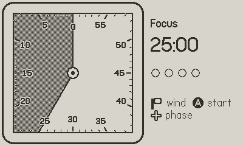

# Pomodial

A wind-up pomodoro timer for [Playdate](https://play.date). Crank it like a kitchen timer and watch the time drain from a square dial, Time Timer style.



## Features

- **Crank to wind.** One minute per 6°; a quarter turn adds 15 minutes, with a tick for every minute.
- **See time left at a glance.** A gray wedge on a square 60-minute face shrinks toward 12, with minutes counting counterclockwise like the classic visual timer.
- **Pomodoro rhythm.** Focus 25 min, short break 5 min, and a long break of 15 min after every fourth focus session. Dots track the cycle.
- **Chime and flash** when a phase ends; the next phase is loaded and waits for you.
- **Desk-timer friendly.** The screen stays on while running, and timing uses the wall clock, so it stays right even if the device sleeps.

## Controls

| Input | Action |
| --- | --- |
| Crank | Wind time up or down |
| Ⓐ | Start / pause |
| Ⓑ | Reset the current phase |
| ⬅️ ➡️ | Switch phase (focus / short break / long break) |
| ⬆️ ⬇️ | Nudge one minute |
| Menu | *Skip phase*, *New cycle* |

## Build

Requires the [Playdate SDK](https://play.date/dev/) (tested with 3.1.2), installed at `~/Developer/PlaydateSDK` or pointed to with `SDK=`.

```bash
make run              # build and open in the Simulator
make build            # just build Pomodial.pdx
make SDK=/path/to/sdk # custom SDK location
```

The Roobert fonts ship with the SDK and aren't redistributable, so the Makefile copies them from your local SDK at build time.

To put it on a Playdate, connect it over USB, unlock it, and use **Device → Upload Game To Device** in the Simulator.

## A note on time on Playdate

Playdate's Lua uses 32-bit floats. Seconds since the epoch (~8×10⁸) only resolve to 64-second steps at that size, so `s + ms / 1000` silently freezes a countdown. Pomodial subtracts an integer base captured at launch before adding milliseconds.

## License

MIT, see [LICENSE](LICENSE). Not affiliated with Panic or Time Timer.
